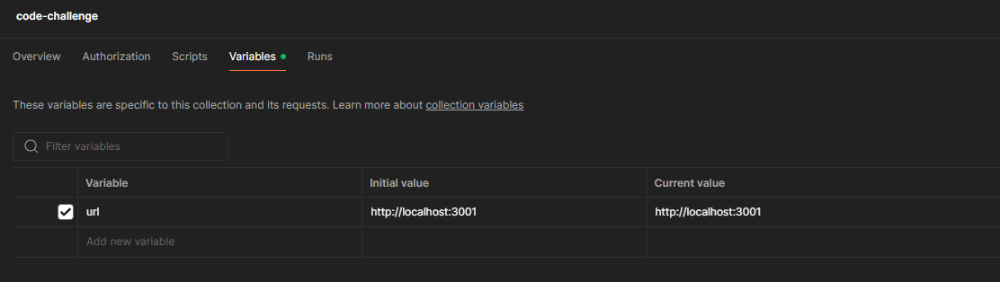

# Problem 5

## Overview

Problem 5 is a basic implementation of problem 6

## How to run the server

Create .env file with the following keys:

```
NODE_ENV: development/production
AUTH_SECRET: secret string for jwt
REDIS_HOST: db url
REDIS_USERNAME: default or username
REDIS_PASSWORD
```

-   `cd src/problem5/backend`
-   `npm i`
-   `npm run dev` or `npm run serve`

## Run gen DB script

Before running this script, you need the NodeJS server running and a redis server. The script create 15 users and 15 entries in a sorted set. Fastest way is to create a free db at [Redis Cloud Console](https://cloud.redis.io/)

-   `cd src/problem5/gen-db-script`
-   `npm i`
-   `ts-node index.ts`

## Postman doc

https://documenter.getpostman.com/view/33953637/2sAYQWKtkE

The postman collection contains some available HTTP requests in the API. Use this to interact with the server. Simply change the url in collection variable if you have an url



## Run the live scoreboard

-   Run the server
-   Generate db
-   Run the index.html `http://127.0.0.1:[port]/src/problem5/index.html`
-   Open more browser windows (optional)

## Notes

Time taken: 2 days

A lot of technologies are new to me, most of the time spent is on researching technologies, planning and skimming docs.
